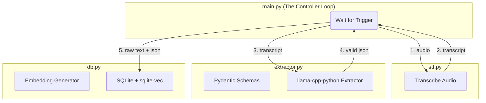

# System Design: Offline Voice Journaling Prototype

## 1. High-Level Architecture

The system is built using a flat, component-based functional architecture to allow rapid iteration and easy swapping of underlying libraries (e.g., changing STT or SLM inference engines).

## 2. Component Boundaries (Contracts)

- **`stt.py`**: Accepts an audio file path, returns the raw transcript string. (Libraries: `faster-whisper` or `whisper-cpp-python`).
- **`extractor.py`**: Accepts a raw transcript, a target schema name, and optional session history. Returns a validated Python dictionary.
- **`db.py`**: Handles generating embeddings and all interactions with `sqlite-vec`. Exposes methods to `save_entry()` and `search_entries()`.
- **`main.py`**: The state machine that orchestrates the flow, handles user prompts, and manages the clarification loop.

## 3. SLM Extraction & Clarification Engine

Extracting structured data from messy voice transcripts is the core challenge. We handle this via:

1.  **Pydantic + GBNF:** Domain schemas are defined as Pydantic models. The schema is injected into the SLM prompt for semantic understanding, while `llama-cpp-python` generates a GBNF grammar to physically constrain the output to valid JSON.
2.  **Explicit Nulls:** The SLM is instructed to output `null` for any unmentioned schema fields (e.g., `{"axle": null}`). The `main.py` controller checks for these nulls to trigger clarification questions.
3.  **Accumulated Session State:** When asking the user a follow-up question, the system passes the entire context (schema, current JSON state, transcript history, and latest utterance) back to the SLM. This allows the model to naturally merge multi-field updates without losing context.
4.  **Model Selection:** We utilize edge-optimized instruct models like `Llama-3.2-3B-Instruct` (Q4 quantized) for their speed and native JSON/tool-calling capabilities. *(See ADR-0001 for more details).*

## 4. RAG (Retrieval-Augmented Generation) Flow

RAG is implemented as a stateless search mechanism, independent of the SLM's weights.

1.  **Embed:** The user's query is embedded into a vector using a lightweight local embedding model (e.g., `all-MiniLM-L6-v2`).
2.  **Retrieve:** We query `sqlite-vec` for the Top-K most similar historical entries.
3.  **Generate:** The retrieved JSON records are formatted into a text block and injected into a new prompt: *"Context: [JSON records]... Answer the user's query."* The SLM then generates the final summary for the user.
